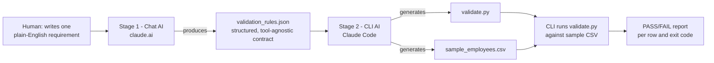

# Multi-Stage AI Workflow: CSV Validator Generator

Chains a **chat-based AI** and a **CLI-based AI** to turn a plain-English
requirement into a tested, working validation script, with no manual
coding in between.

## Problem

"I have a CSV of employee records and need to check it's clean before
loading it anywhere, but writing the validation rules by hand and then
writing the validator script by hand is two separate manual jobs."

This is split into two stages, each handed to a different AI UX type:

| Stage | UX type | Tool used | Input | Output |
|-------|---------|-----------|-------|--------|
| 1 | Chat | claude.ai (any chat AI works the same way) | A one-paragraph requirement, typed as a prompt | `evidence/stage-1-chat/validation_rules.json`, a structured rules contract |
| 2 | CLI | Claude Code (any CLI AI works the same way) | `validation_rules.json` from Stage 1 | `evidence/stage-2-cli/validate.py` and `sample_employees.csv`, executed and verified |

## Workflow Diagram



The hand-off point is `validation_rules.json`: it is the *output* of Stage 1
and the *input* of Stage 2, which is exactly the "chain outputs between two
UX types" requirement. Nothing is retyped by hand between stages.

## Step-by-Step Notes

1. **Define the requirement.** One sentence: "validate a CSV of employee
   records: name, age (18 to 65), email on the amalitech.com domain,
   department (one of four values)."

2. **Stage 1: Chat AI (claude.ai).** The following prompt was sent
   (screenshot: [`evidence/stage-1-chat/prompt.png`](evidence/stage-1-chat/prompt.png)):

   ```
   I need a validation ruleset for a CSV file of employee records.

   Output ONLY a JSON object (no prose, no markdown fences) with this exact shape:

   {
     "csv_file": "<expected filename>",
     "fields": [
       {
         "name": "<column name>",
         "type": "<one of: string | integer | email | enum>",
         "required": true | false,
         "min": <number, only for integer, optional>,
         "max": <number, only for integer, optional>,
         "values": [<strings>, only for enum]
       }
     ]
   }

   The CSV should represent employee records with these columns:
   - name (non-empty text)
   - age (whole number, must be between 18 and 65)
   - email (use amalitech domain: amalitech.com)
   - department (must be one of: Engineering, Sales, HR, Marketing)

   All four fields are required.
   ```

   It replied with a JSON object (screenshot:
   [`evidence/stage-1-chat/response.png`](evidence/stage-1-chat/response.png)),
   saved as
   [`evidence/stage-1-chat/validation_rules.json`](evidence/stage-1-chat/validation_rules.json).

   > **Note:** the chat AI's JSON schema has no field for enforcing an email
   > *domain*, only a generic `"type": "email"`. The prompt asked for an
   > amalitech.com-only rule, and the contract format could not fully
   > express it. This is a real, observed limitation of the hand-off, not a
   > scripted one. Stage 2 validates exactly what the JSON contract says
   > (generic email format), nothing more.

3. **Stage 2: CLI AI (Claude Code).** The JSON from Stage 1 was fed to
   Claude Code in two prompts (screenshots:
   [`prompt-1.png`](evidence/stage-2-cli/prompt-1.png),
   [`prompt-2.png`](evidence/stage-2-cli/prompt-2.png)):

   ```
   Read multi-stage-ai-workflow/evidence/stage-1-chat/validation_rules.json
   (a JSON validation ruleset produced by a chat AI). Generate:

   1. validate.py: a standalone Python script that:
      - loads a rules JSON file and a CSV file (both given as CLI arguments)
      - validates every row of the CSV against the rules
        (required fields, string non-empty, integer within a minimum and
        maximum range, basic email format, enum membership)
      - prints a PASS/FAIL line per row with the specific reason(s) it failed
      - prints a summary (X/Y rows valid)
      - exits with status code 1 if any row is invalid, 0 otherwise

   2. sample_employees.csv: sample data with a mix of valid and
      deliberately invalid rows, so the validator's failure paths are
      actually exercised.
   ```

   This generated
   [`evidence/stage-2-cli/validate.py`](evidence/stage-2-cli/validate.py) and
   [`evidence/stage-2-cli/sample_employees.csv`](evidence/stage-2-cli/sample_employees.csv).

4. **Run it end-to-end:**
   ```bash
   python3 evidence/stage-2-cli/validate.py evidence/stage-1-chat/validation_rules.json evidence/stage-2-cli/sample_employees.csv
   ```

5. **Verify.** Terminal output, captured in
   [`evidence/stage-2-cli/test-output.png`](evidence/stage-2-cli/test-output.png):
   **2/7 rows valid**, with the 5 failures each reporting the correct,
   specific reason:
   - Row 2: age 17 below minimum 18
   - Row 3: malformed email (`bob.owusu-at-amalitech.com`)
   - Row 4: required `name` empty
   - Row 5: `department` = "Finance" not in the allowed list
   - Row 6: age 68 above maximum 65

   This proves the chain produced a genuinely working validator, not just
   plausible-looking code.

## Why This Is Adaptable (tool-agnostic)

- The Stage 1→2 contract is **plain JSON**, not a format specific to any
  vendor's chat product.
- The Stage 1 prompt only requires "a chat AI that can follow formatting
  instructions," which is true of ChatGPT, Claude.ai, Gemini, and similar
  tools.
- The Stage 2 prompt only requires "a CLI AI that can read and write files
  and run shell commands," which is true of Claude Code, Gemini CLI, Aider,
  and similar tools.
- Swapping either tool requires zero changes to the other stage.

## Repo Layout

```
multi-stage-ai-workflow/
├── README.md                                  <- this file
└── evidence/
    ├── stage-1-chat/
    │   ├── prompt.png                         <- screenshot: prompt sent to claude.ai
    │   ├── response.png                       <- screenshot: chat AI's JSON response
    │   └── validation_rules.json              <- saved Stage 1 output / Stage 2 input
    └── stage-2-cli/
        ├── prompt-1.png                       <- screenshot: prompt given to Claude Code (validate.py spec)
        ├── prompt-2.png                       <- screenshot: prompt given to Claude Code (sample CSV spec)
        ├── validate.py                        <- generated validator
        ├── sample_employees.csv               <- generated test data
        └── test-output.png                    <- screenshot: terminal PASS/FAIL run output
```
